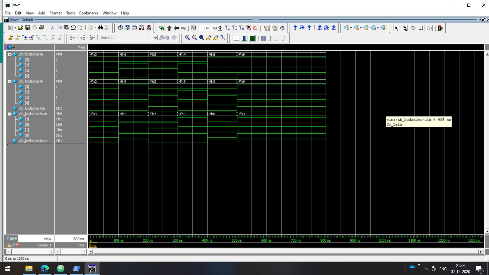
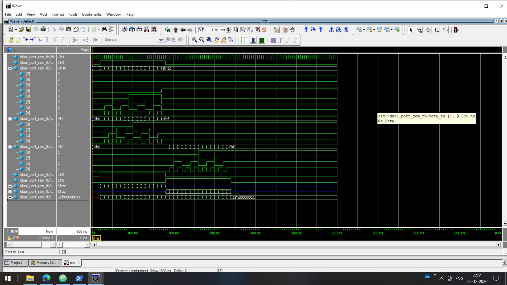
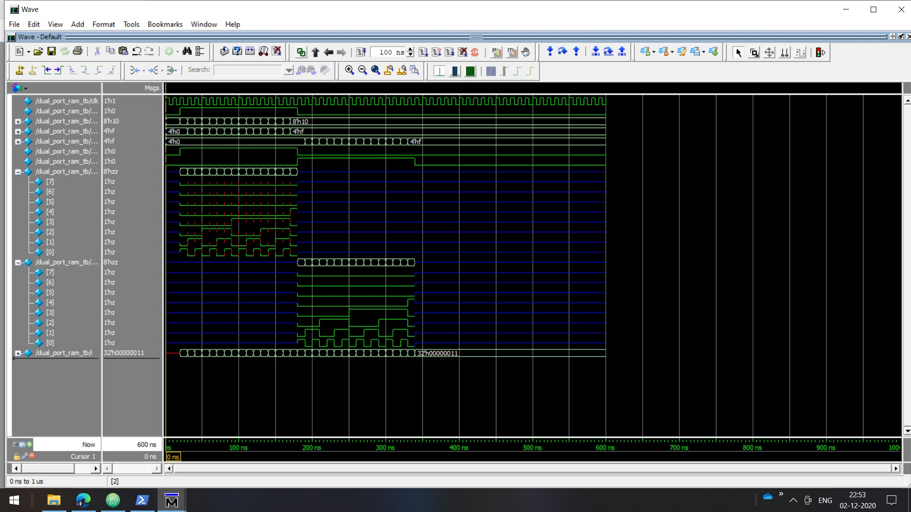
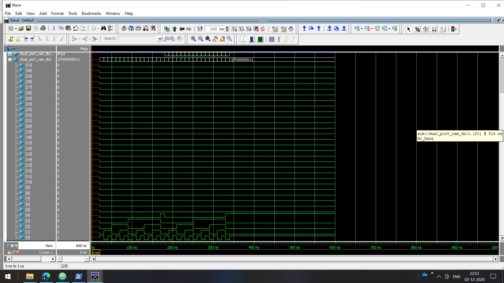
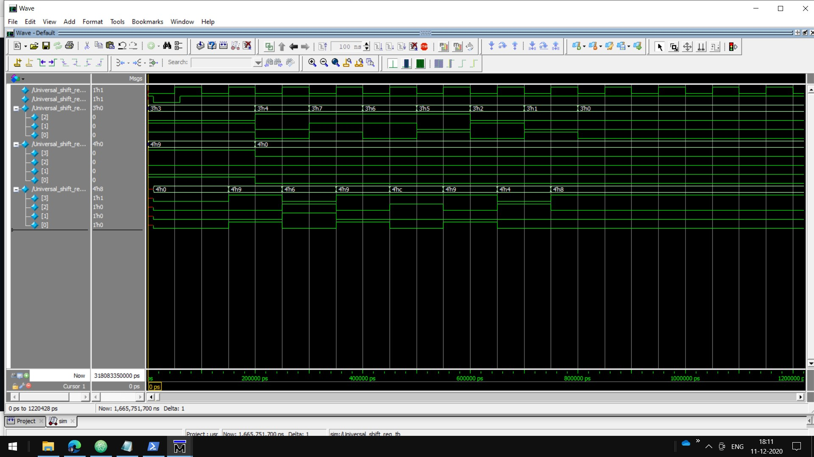

# 32 Verilog Mini Projects
[IEEE 754 Division](Floating%20Point%20IEEE%20754%20Division/division.v)

[IEEE 754 Addition Subtraction](Floating%20Point%20IEEE%20754%20Addition%20Subtraction/Addition_Subtraction.v)

[IEEE 754 Multiplication](Floating%20Point%20IEEE%20754%20Multiplication)

CRC Coding                                                          
[CRC_16_parallel](CRC%20Coding/CRC_16_parallel)

[CRC_16_serial](CRC%20Coding/CRC_16_serial)

[CRC_32_parallel](CRC%20Coding/CRC_32_parallel)

[CRC_32_serial](CRC%20Coding/CRC_32_serial)

[BCD Adder](/bcd_adder)
 
[Dual Address ROM](/dual_address_rom)

[Dual Address RAM](/dual_address_ram)

[Restoring and Non Restoring Division](/Restoring%20and%20Non%20Restoring%20Division)

[Universal Shift Register](/Universal_Shift_Register)

[Barrel Shifter 8bit](/Barrel%20Shifter)

[Booth Multiplier](/Booth%20Multiplication)

[32 Bit Adder](32%20bit%20adder)

[Mealy State Machine for sequence detection](Mealy%20and%20Moore%20State%20Machine%20Implementation%20of%20Sequence%20Detector)

[Moore State Machine for sequence detection](Mealy%20and%20Moore%20State%20Machine%20Implementation%20of%20Sequence%20Detector)

[Array Multiplier](Array%20Multiplier)

[Carry Skip Adder](Carry%20Skip%20and%20Carry%20Save%20Adder)

[Carry Select Adder](Carry%20Select%20and%20Carry%20Look%20Ahead%20Adder)

[Carry Look Ahead Adder](Carry%20Select%20and%20Carry%20Look%20Ahead%20Adder)

[Carry Save Adder](Carry%20Skip%20and%20Carry%20Save%20Adder)

[Complex Multiplier](Complex%20Multiplier)

[Logarithm Implementation](Logarithm%20Implementation)

[Traffic_Light_Controller](Traffic%20Light%20Controller)

